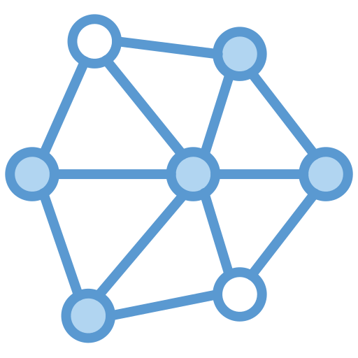

# GridCaller

A sober, local-first mesh communications platform for education, research, and controlled demonstrations.



GridCaller brings together a polished phone-style experience with device-to-device communication over a self-hosted mesh network. The project is designed for environments where a carrier network is unavailable or where a local, privacy-conscious deployment is preferred.

## Overview

GridCaller is intended for:
- educational and research use
- controlled field testing
- local demonstrations and lab environments
- experimentation with mesh-based communication patterns

This repository is not positioned as a commercial telephony service. It is a technical platform for understanding and testing resilient communication behavior in a local-first setting.

## What the project includes

- a phone-like interface for calls, recents, contacts, and messaging flows
- local mesh discovery and connectivity over Wi-Fi, swarm, hop, and nearby Bluetooth paths
- permission-aware onboarding and an explicit consent gate before startup
- self-hosted hub and bridge components for local deployment
- Android packaging support for installation and field testing

## Getting started

### Prerequisites
- Node.js 18 or newer
- npm
- optional: Android Studio for APK packaging

### Local setup
```bash
npm install
npm run build
npm run hub
```

Open the app in a browser at:
```text
http://<your-pc-ip>:8765
```

### Android build
```bash
npm run cap:sync
npx cap open android
```

## Repository structure

- src/App.tsx — application bootstrap and startup lifecycle
- src/GridCaller.tsx — main phone-style interface
- src/kernel — mesh, call, permissions, identity, storage, and connectivity logic
- server — local hub and bridge services
- share — APK distribution and update assets
- docs/images — project screenshots and visual assets

## Notes for users and reviewers

- The app requests permissions and requires explicit consent before continuing. This is intentional and helps keep the experience transparent.
- For the best demo experience, keep the devices on the same local network and use the included hub service.
- The project is best understood as a research and prototyping platform rather than a production carrier replacement.
