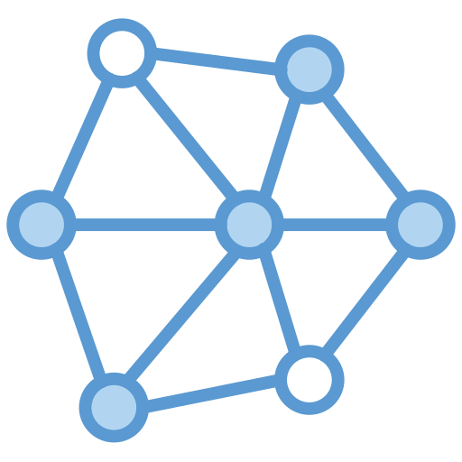

# GridCaller

[](LICENSE)
[](#community-development)
[](https://23mahendra.github.io/Gridcaller/)

**Offline-first mesh communication project — open for community development.**

> GridCaller is an actively developed open-source project. Some subsystems are functional, while other parts still require implementation, testing, hardening, and real-device validation. The goal is to build a local-first communication platform that can remain useful without paid carrier services or mandatory paid APIs.



## Community Development

The foundation is public. The next stage is community-driven: developers, researchers, Android engineers, WebRTC/networking contributors, security reviewers, designers, and testers are invited to complete and improve the remaining work.

### Current development areas

- Push-to-Talk Radio
- Bluetooth / Nearby transport
- Wi-Fi Direct
- Multi-hop routing
- WebRTC reliability
- Android integration
- Security hardening
- Performance and battery optimization
- Test coverage and real-device validation

Contributions can be submitted through Issues and Pull Requests. Please verify changes on real devices whenever a feature depends on device networking, microphone, Bluetooth, or Android behavior.


A sober, local-first mesh communications platform for education, research, and controlled demonstrations.


GridCaller brings together a polished phone-style experience with device-to-device communication over a self-hosted mesh network. The project is designed for environments where a carrier network is unavailable or where a local, privacy-conscious deployment is preferred.

## Overview

GridCaller is intended for:
- educational and research use
- controlled field testing
- local demonstrations and lab environments
- experimentation with mesh-based communication patterns

This repository is not positioned as a commercial telephony service. It is a technical platform for understanding and testing resilient communication behavior in a local-first setting.

## What the project includes

- a phone-like interface for calls, contacts, keypad, messaging, and Gridchat flows
- local mesh discovery and connectivity over Wi-Fi, swarm, hop, and nearby Bluetooth paths
- permission-aware onboarding and an explicit consent gate before startup
- self-hosted hub and bridge components for local deployment
- Android packaging support for installation and field testing

## Getting started

### Prerequisites
- Node.js 18 or newer
- npm
- optional: Android Studio for APK packaging

### Local setup
```bash
npm install
npm run build
npm run hub
```

Open the app in a browser at:
```text
http://<your-pc-ip>:8765
```

### Docker self-hosting (local-first)
```bash
docker compose up --build
```

Then open:
```text
http://127.0.0.1:8765
```

Notes:
- `gridcaller` runs the local hub + static UI.
- `ollama` runs local LLM APIs for chat/embeddings.
- Optional `offgrid` profile can be enabled for local image/voice APIs:
  - `docker compose --profile optional up --build`
- Default STUN list is empty to avoid central dependency by default.

### Android build
```bash
npm run cap:sync
npx cap open android
```

## Repository structure

- src/App.tsx — application bootstrap and startup lifecycle
- src/GridCaller.tsx — main phone-style interface
- src/kernel — mesh, call, permissions, identity, storage, and connectivity logic
- server — local hub and bridge services
- share — APK distribution and update assets
- docs/images — project screenshots and visual assets

## Notes for users and reviewers

- The app requests permissions and requires explicit consent before continuing. This is intentional and helps keep the experience transparent.
- For the best demo experience, keep the devices on the same local network and use the included hub service.
- The project is best understood as a research and prototyping platform rather than a production carrier replacement.
- AI chat now supports hub-backed local RAG: add your own notes/SOPs in the AI panel and retrieval is indexed by the local hub for reuse across clients on the same self-hosted setup.

## Support GridCaller

GridCaller is an open-source, local-first mesh communications platform.

If you'd like to support development, testing, and field deployments, you can contribute here:

**Support:** https://rzp.io/rzp/CZkogkJU

Every contribution helps improve offline-first communications.
